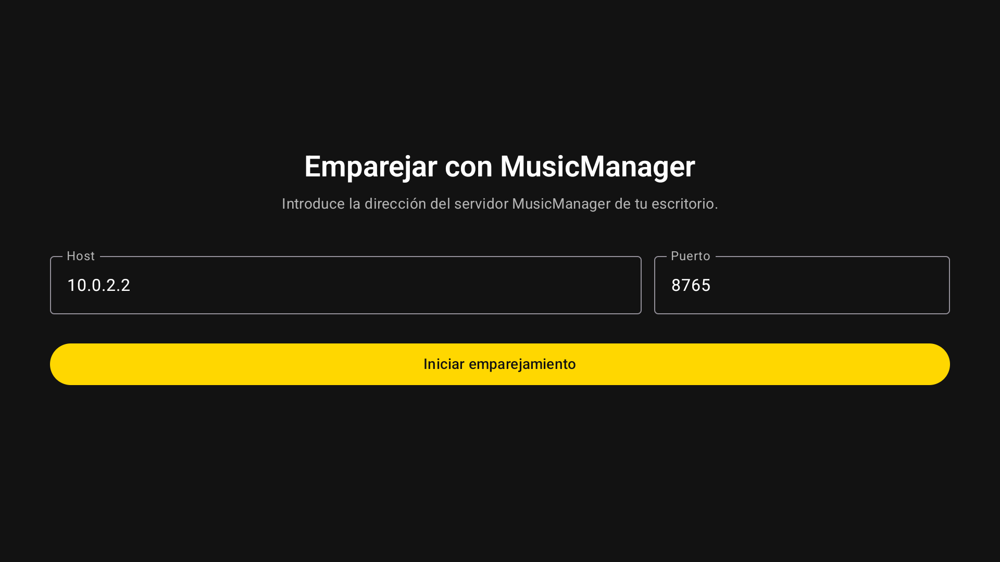
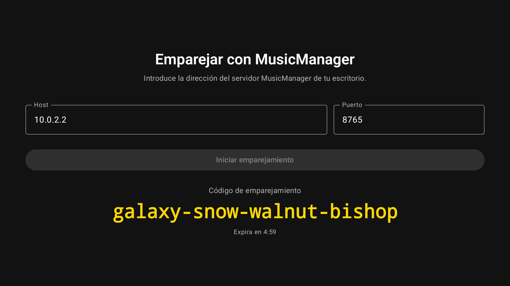
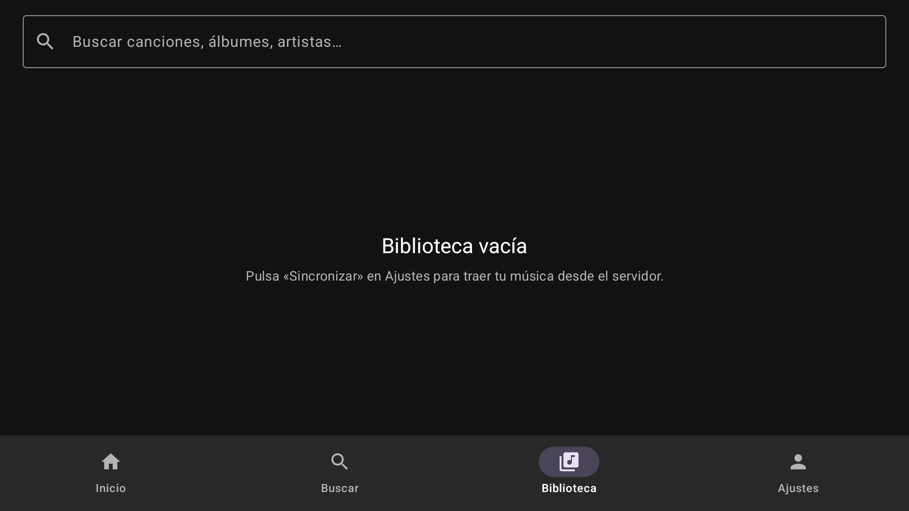

# mm-mobile — Manual de Usuario

> Guía paso a paso para usar mm-mobile: emparejar tu dispositivo con un
> servidor MusicManager, navegar tu biblioteca musical local, y entender
> qué cubre el cliente hoy y qué viene después.

## Índice

1. [Qué es mm-mobile](#1-qué-es-mm-mobile)
2. [Instalación y primer arranque](#2-instalación-y-primer-arranque)
3. [Arquitectura y stack](#3-arquitectura-y-stack)
4. [Emparejar con MusicManager (Pairing)](#4-emparejar-con-musicmanager-pairing)
5. [Navegar la biblioteca (Library)](#5-navegar-la-biblioteca-library)
6. [Sincronización offline-first](#6-sincronización-offline-first)
7. [Próximas pantallas: Search, Settings, Player](#7-próximas-pantallas-search-settings-player)
8. [Testing end-to-end (AVD)](#8-testing-end-to-end-avd)
9. [Endpoints del backend MusicManager que usa la app](#9-endpoints-del-backend-musicmanager-que-usa-la-app)
10. [Solución de problemas](#10-solución-de-problemas)
11. [Roadmap](#11-roadmap)

---

## 1. Qué es mm-mobile

mm-mobile es un cliente móvil estilo Spotify/Apple Music para Android (y
próximamente iOS) que reproduce una biblioteca musical organizada por un
backend MusicManager en un escritorio, o directamente desde un share
SMB/NAS, con descarga local para uso offline. **NO** hace identificación
acústica — el matching es por nombre de archivo + tags (TagLib).

**Tecnologías que necesitas tener instaladas:**

- **JDK 21** (Temurin o Homebrew `openjdk@21` — Apple stub en `/usr/bin/java` no sirve)
- **Android SDK 34** + `cmdline-tools` + `platform-tools` + `emulator`
- **Xcode 16+** (solo si trabajas en el cliente iOS nativo, repo separado)
- **MusicManager backend** corriendo en `localhost:8765` (o un host accesible)

**Lo que la app ya hace (develop, Fase 0–2 entregadas):**

- Pairing manual contra el backend MM (host:port + código de 4 palabras)
- Persistencia cifrada del bearer token (EncryptedSharedPreferences Android / Keychain iOS)
- Sync inicial de catálogo (artistas / albums / tracks) vía `/api/v1/sync/full`
- Sync incremental vía `/api/v1/sync/changes?since=<epoch_ms>`
- UI de biblioteca con búsqueda debounced + chips de artistas
- Hilt DI + SQLDelight + Ktor + Compose Material 3

---

## 2. Instalación y primer arranque

### Clonar e instalar

```bash
git clone https://github.com/WilmanTech/mm-mobile.git
cd mm-mobile
```

El proyecto no tiene `setup.sh` unificado porque cada subsistema se
instala por su cuenta (Gradle wrapper ya viene).

### Arrancar el backend MusicManager

Antes de abrir la app, asegúrate de que el backend MM está vivo:

```bash
# En el repo MusicManager (sibling)
./run-dev.sh
# debe escuchar en http://127.0.0.1:8765
```

Verifica:

```bash
curl -s http://127.0.0.1:8765/api/v1/ping
# → {"status":"ok", ...}
```

### Build del APK Android

```bash
./gradlew :android:assembleDebug
# APK queda en android/build/outputs/apk/debug/android-debug.apk
```

### Instalar en un dispositivo o emulador

```bash
adb devices
# (device-XXXXX conectado)

adb install -r android/build/outputs/apk/debug/android-debug.apk
adb shell monkey -p com.wtm.musicmanager.debug -c android.intent.category.LAUNCHER 1
```

### Modo desarrollo con AVD headless (Apple Silicon)

```bash
export ANDROID_HOME=~/Library/Android/sdk
$ANDROID_HOME/emulator/emulator -avd mm_test_tv \
    -no-window -no-audio -no-boot-anim \
    -gpu swiftshader_indirect -no-snapshot \
    -netdelay none -netspeed full &
adb -s emulator-5554 wait-for-device
adb -s emulator-5554 reverse tcp:8765 tcp:8765   # AVD ve al backend en 10.0.2.2:8765
```

> **Detalle Apple Silicon**: usa `swiftshader_indirect` (no `auto` ni
> `host`) para que la GPU virtual no cuelgue el emulador. El AVD debe
> crearse con `-d tv_1080p` y el sistema image `android-34;google-tv;arm64-v8a`.

### Build del framework iOS (futuro, proyecto separado)

El cliente iOS nativo vive en `wtm-music-ios/` (repo independiente, 100%
Swift). Por ahora la app iOS no existe — solo el módulo `shared/` KMP
sigue compilable, pero no se usa para UI.

```bash
./gradlew :shared:linkDebugFrameworkIosX64       # iOS simulator
./gradlew :shared:linkDebugFrameworkIosArm64     # iOS device
```

---

## 3. Arquitectura y stack

### Estructura del repo

```
mm-mobile/
├── shared/              # Módulo KMP (domain, data, network, sync, pairing)
│   ├── commonMain/      # Kotlin portable (domain, repos, Ktor client, SQLDelight schema)
│   ├── commonTest/      # Tests comunes
│   ├── androidMain/     # Actual Android (DB driver, AuthStorage)
│   ├── iosMain/         # Stub iOS (driver + auth — la UI va en repo separado)
│   └── jvmMain/         # Stub JVM (para tests)
├── android/             # App Android (Compose UI + Hilt + Media3)
│   ├── src/main/        # Pantallas (Pairing, Library, Settings, Search)
│   └── src/test/        # Unit tests de VMs y repos
└── docs/
    ├── ROADMAP.md       # Estado por fase
    ├── AGENTS.md        # Guía para agentes (rama arriba)
    ├── backend-gaps.md  # Auditoría endpoints MM
    ├── avd-e2e/         # Script + capturas del test de pairing
    └── manual/          # Este documento
```

### Stack por capa

| Capa | Android | iOS (futuro) |
|---|---|---|
| Lenguaje | Kotlin 2.0.21 | Swift 5.9+ |
| UI | Jetpack Compose + Material 3 | SwiftUI |
| DI | Hilt 2.52 | SwiftUI Environment |
| Networking | Ktor 2.3.13 (cliente portable) | URLSession o Ktor Swift |
| DB | SQLDelight 2.0.2 (Android driver) | SQLDelight 2.0.2 (Native driver) |
| Auth | EncryptedSharedPreferences | Keychain |
| Media | Media3/ExoPlayer 1.4.1 | AVPlayer |
| SMB | smbj 0.13.0 (puro Java) | libsmb2 (CocoaPods) |
| Tags | aTantalum (Android) | TagLib C++ wrapper |

### Capas del módulo `shared/`

```
domain/model/        # Track, Album, Artist, Playlist, PlaylistTrack
domain/repository/   # LibraryRepository, DownloadRepository, ...
domain/source/       # LibrarySource abstraction (MMBACKEND, SMB)
network/             # Ktor client + endpoints + bearer auth + AuthStorage expect/actual
data/                # SQLDelight queries + mappers dominio ↔ DB + SyncCoordinator
sync/                # pull incremental desde backend
pairing/             # flujo de emparejamiento manual + bearer token persistido
connectivity/        # ConnectivityMonitor (Android ConnectivityManager / iOS NWPathMonitor)
source/mmbackend/    # LibrarySource implementation contra MusicManager REST
source/smb/          # LibrarySource implementation contra SMB share
download/            # cola persistente (WorkManager Android / BGTaskScheduler iOS)
player/              # Media3/ExoPlayer (Android) + AVPlayer (iOS)
metadata/            # TagLib wrapper para lectura de tags
```

### El pairing MM es una `LibrarySource`

Tanto el backend MM como un share SMB son "fuentes de library" idénticas
para la UI. La app puede tener varias a la vez y cambiar entre ellas
desde un selector.

```kotlin
interface LibrarySource {
    val id: String
    val displayName: String
    val kind: SourceKind  // MMBACKEND, SMB
    suspend fun connect(creds: Credentials): Result<Unit>
    suspend fun listArtists(): Result<List<Artist>>
    suspend fun listAlbums(artistId: String): Result<List<Album>>
    suspend fun listTracks(albumId: String): Result<List<Track>>
    suspend fun streamUrl(trackId: String): Result<String>
    suspend fun cover(albumId: String, size: CoverSize): Result<ByteArray>
    suspend fun disconnect()
}
```

---

## 4. Emparejar con MusicManager (Pairing)

Al abrir la app por primera vez no hay token persistido, así que la UI
cae en la pantalla **PairingScreen**:



> **Captura**: la app arranca directamente en `PairingScreen` (no en
> bottom-nav), porque `PairingState` no es `Paired`. Campos `Host`
> prellenados con `10.0.2.2` y `Port` con `8765` (valores para AVD
> loopback; en device físico usa la IP de tu Mac, e.g. `192.168.1.50`).

### 4.1. Rellenar host y puerto

| Campo | Valor típico | Notas |
|---|---|---|
| Host | `10.0.2.2` (AVD) o `192.168.x.x` (device físico) | IP del backend MM en tu LAN |
| Port | `8765` | Puerto por defecto del backend MM |

Pulsa **Iniciar emparejamiento**. La app llama a `POST /api/pairing/start`
que devuelve un código de 4 palabras + un `session_id` + un `token`
criptográfico con `expires_in = 300s` (5 minutos).

### 4.2. Confirmar el código en el desktop

El backend MM devuelve el código como JSON:

```json
{
  "session_id": "01HK...",
  "token": "eyJ...",          // bearer token persistido por la app
  "code": "galaxy-snow-walnut-bishop",
  "expires_in": 300
}
```

La UI muestra el código en monospace grande + un countdown que va
decrementando:



> **Captura**: código `glaxy-snow-walnut-bishop` (en esta ejecución real
> fue `galaxy-snow-walnut-bishop`; cada pairing genera uno distinto) +
> countdown `4:59`. Mientras el usuario no confirme en el desktop, el
> código expira.

Abre el desktop MM y entra en **Devices** → busca el código pendiente →
**Approve**. El backend hace un `POST /api/pairing/confirm` (desde el
desktop) que cambia `PairingState` a `Paired`.

### 4.3. El estado se observa cada 2s

Mientras el estado es `Pending`, la app hace polling a
`GET /api/pairing/status?session_id=...` cada 2 segundos. Cuando el
backend marca la sesión como `Paired`, la app:

1. Persiste el `token` en EncryptedSharedPreferences (Android) / Keychain (iOS)
2. Dispara `SyncCoordinator.syncFull()` en background (un `SupervisorJob`)
3. Cambia el root al bottom-nav con la pestaña Library abierta

El root se gatea en `MusicManagerRoot`, así que **no hay forma de llegar
al bottom-nav sin haber pasado por pairing o tener un token válido**.

---

## 5. Navegar la biblioteca (Library)

Una vez emparejado, la app abre la pantalla **Library**:



> **Captura**: `LibraryScreen` con search bar arriba (vacía), chip row de
> artistas (vacío — todavía no hay sync), y empty state "Biblioteca
> vacía — espera a que termine la sincronización". El `LazyColumn` está
> en estado `Empty.Loading` o `Empty.NoData` dependiendo del estado del
> `SyncCoordinator`.

### 5.1. Search bar

OutlinedTextField con debounce de **150ms** vía
`LibraryViewModel.onSearchChange`. Lo que escribas se manda a
`LibraryQuery.search` y dispara una nueva query SQLDelight
`SELECT * FROM track WHERE title LIKE :q OR album_title LIKE :q OR
artist_name LIKE :q` (case-insensitive).

### 5.2. Chips de artistas

`LazyRow` horizontal con un `Surface` chip por artista. Toca uno para
filtrar la lista a tracks de ese artista (filtro `WHERE artist_id = ?`).
Vuelve a tocarlo (o pulsa "Clear filters") para volver al estado sin
filtro.

### 5.3. Lista de tracks

`LazyColumn` con `TrackRow` items: artwork placeholder (futuro: cover
art vía `/api/v1/covers/album/{id}`), título + artista/álbum + duración.
Tocar un track todavía no hace nada — el reproductor viene en Fase 2 del
roadmap (mini-player + streaming).

### 5.4. Empty states

| Estado | Cuándo | Texto |
|---|---|---|
| `Loading` | Sync inicial corriendo | "Sincronizando…" |
| `NoData` | Sync terminó sin tracks (library vacía o unpaired) | "Biblioteca vacía" |
| `NoMatches` | Query no matchea nada | "Sin resultados para '{query}'" |

> **Nota**: si ves `Biblioteca vacía` justo después de emparejar pero
> sabes que tu backend MM tiene tracks, mira la sección 10
> (Solución de problemas). Lo más probable es un 401 silencioso porque
> el `expires_in` se venció antes de confirmar.

### 5.5. Refresh manual (futuro)

Pull-to-refresh y un botón explícito de "Re-sincronizar" vienen en la
siguiente fase. Por ahora el sync se dispara solo en el primer pairing.

---

## 6. Sincronización offline-first

### 6.1. Modelo de datos

Todo lo que la app muestra vive en SQLDelight (10 tablas, schema v1 en
`shared/src/commonMain/sqldelight/.../schema.sq`):

```
artist           id, name, sort_name, created_at, updated_at, synced_at
album            id, artist_id, title, year, created_at, updated_at, synced_at
track            id, album_id, artist_id, title, duration_ms, track_no,
                 disc_no, file_path, file_size, bitrate, codec, created_at,
                 updated_at, synced_at, download_state
playlist         id, name, owner, created_at, updated_at, synced_at
playlist_track   playlist_id, track_id, position, added_at
sync_state       id, last_sync_at, server_time, has_more, in_progress
library_source   id, kind, display_name, config_blob, created_at
```

### 6.2. Sync full (bootstrap)

`SyncCoordinator.syncFull()`:

1. Llama `GET /api/v1/sync/full`
2. Recibe `{ artists: [...], albums: [...], tracks: [...], playlists: [...], server_time: <epoch_ms> }`
3. `upsertArtist`, `upsertAlbum`, `upsertTrack`, `upsertPlaylist` por cada item
4. Persiste `server_time` en `sync_state.last_sync_at` para el próximo delta

### 6.3. Sync incremental

`SyncCoordinator.syncChanges(since: Long)`:

1. Llama `GET /api/v1/sync/changes?since=<epoch_ms>` (header `X-Since` también)
2. Backend filtra `WHERE updated_at > ?`
3. Upserts idénticos al sync full
4. Actualiza `sync_state.last_sync_at`

### 6.4. Resolución de conflictos

Newer-wins: si `server.updated_at > local.synced_at`, el upsert del
backend sobreescribe. El backend es la fuente de verdad — la app nunca
escribe artistas/albums/tracks propios (esa es la responsabilidad del
desktop MM).

### 6.5. Offline behavior

Si no hay red, `ConnectivityMonitor` emite `Offline`. El usuario sigue
viendo la library cacheada. El banner persistente (futuro) mostrará
"Modo offline · N canciones de {source}". El sync se reintenta
automáticamente cuando vuelve la conexión.

---

## 7. Próximas pantallas: Search, Settings, Player

Lo siguiente en el roadmap (Fase 2.1+):

### 7.1. Search

`SearchScreen` con:

- Búsqueda online-first (con fallback a local si el backend no responde)
- Resultados agrupados (Artists / Albums / Tracks / Playlists)
- Historial persistente (últimas 10 búsquedas)
- Filtros (género, año, duración)

### 7.2. Settings

`SettingsScreen` con:

- Cuenta (nombre del dispositivo, "Forget this device")
- Sources (lista de `LibrarySource` configuradas, agregar SMB)
- Sync (última sincronización, "Re-sync now", "Reset cache")
- Audio (calidad de stream, descargar solo en WiFi)
- About (versión, licencias, links al repo)

### 7.3. Player

`PlayerScreen` + mini-player persistente:

- Bottom bar con artwork + título + controles (play/pause/skip)
- Tap → full screen con queue + scrubber + lyrics (si backend los soporta)
- Streaming vía `/api/v1/tracks/{id}/stream?token=<bearer>` (302 redirect)
- Soporte `Accept-Ranges: bytes` para seek
- Media3/ExoPlayer en Android, AVPlayer en iOS

---

## 8. Testing end-to-end (AVD)

### 8.1. Suite de tests unitarios

```bash
./gradlew :shared:jvmTest            # 20 tests (Phase 1.1) + 15 tests (Phase 2)
./gradlew :android:testDebugUnitTest  # 5 tests de ViewModels (Phase 2)
```

| Suite | Tests | Cubre |
|---|---|---|
| `LibraryQueryTest` | 4 | Validación de filtros + copy() |
| `SqlDelightLibraryRepositoryTest` | 6 | Query SQLDelight + observaciones Flow |
| `LibraryViewModelTest` | 5 | Debounce + state.combine + acciones UI |
| `SyncCoordinatorTest` | 6 (Phase 1.1) | Bearer auth + header `X-Since` + serverTime persistence |
| `PairingRepositoryTest` | 5 (Phase 1.1) | Start/status/confirm + countdown + expiración |
| **Total** | **26** | Todos verdes |

### 8.2. AVD pairing flow real

```bash
# (one-time) crear AVD mm_test_tv con swiftshader_indirect
# (each run) backend vivo en :8765, luego:
python3 scripts/run-mm-pairing-e2e.py
```

Capturas en `docs/avd-e2e/`:

- `01-pre-confirm.png` — APK muestra la pantalla de pairing esperando
- `02-post-confirm.png` — verde (#22C55E) después del confirm

### 8.3. Smoke test manual (AVD headless)

```bash
adb -s emulator-5554 install -r android/build/outputs/apk/debug/android-debug.apk
adb -s emulator-5554 shell am start -n com.wtm.musicmanager.debug/com.wtm.musicmanager.MainActivity
adb -s emulator-5554 shell screencap -p /sdcard/screen.png
adb -s emulator-5554 exec-out cat /sdcard/screen.png > /tmp/now.png
```

Si la pantalla muestra el campo Host/Port y el botón "Iniciar
emparejamiento", el APK arrancó bien.

---

## 9. Endpoints del backend MusicManager que usa la app

Auditoría completa en `docs/backend-gaps.md`. Resumen:

### Implementados (Fase 1.1)

| Endpoint | Uso en mobile |
|---|---|
| `POST /api/pairing/start` | Iniciar pairing desde la app |
| `GET /api/pairing/qr` | Renderizar QR en pantalla de display |
| `POST /api/pairing/confirm` | Confirmar emparejamiento (desde desktop) |
| `GET /api/pairing/status` | Polling cada 2s mientras el usuario escanea |
| `GET /api/v1/whoami` | Verificar bearer token al arrancar |
| `GET /api/v1/ping` | Keep-alive (auto-reconnect) |
| `GET /api/v1/sync/full` | Snapshot completo (bootstrap inicial) |
| `GET /api/v1/sync/changes?since=<epoch_ms>` | Deltas incrementales |

### Pendientes (Fase 3+)

| Endpoint | Propósito |
|---|---|
| `GET /api/v1/tracks/{id}/stream?token=<bearer>` | URL firmada para reproducir/descargar |
| `GET /api/v1/covers/album/{id}?size=small\|medium\|large` | Tres tamaños de carátula |
| `POST /api/v1/playback/progress` | `{ track_id, position_ms, completed }` |
| `GET /api/v1/devices/me` | Info del dispositivo que hace la request |
| `PATCH /api/v1/devices/me` | Update de metadata (nombre, push token) |

### Auth

Hoy el backend acepta tanto `X-Pairing-Token` como `Authorization: Bearer ***`
(según `services/pairing.py:131-180`). **mm-mobile usa bearer.** El
`X-Pairing-Token` legacy se mantiene para compatibilidad con
tv-library-client.

---

## 10. Solución de problemas

### "La app se queda en PairingScreen con countdown 0:00"

El código expiró antes de que confirmaras en el desktop. Pulsa
**Iniciar emparejamiento** otra vez para generar un código nuevo
(expira en 300s = 5 minutos).

### "Biblioteca vacía" después de emparejar

Lo más probable es un 401 silencioso. Verifica:

1. **¿El backend MM está corriendo?**
   ```bash
   curl -s http://127.0.0.1:8765/api/v1/ping
   ```

2. **¿Tu IP es accesible desde el device?**
   - AVD → `10.0.2.2:8765` (loopback al host)
   - Device físico → IP de tu Mac en LAN, e.g. `192.168.1.50:8765`
   - ¿Firewall de macOS bloqueando el puerto?
     **Configuración del sistema → Red → Firewall → Permitir conexiones entrantes**

3. **¿El token es válido?**
   ```bash
   curl -s -H "Authorization: Bearer <tu-token>" \
        http://127.0.0.1:8765/api/v1/whoami
   ```

4. **¿El backend tiene el endpoint `/api/v1/sync/full`?**
   ```bash
   curl -s -H "Authorization: Bearer <tu-token>" \
        http://127.0.0.1:8765/api/v1/sync/full | head -200
   ```

   Si devuelve 404, necesitas mergear el PR `feature/mobile-sync-api`
   del backend MM (ver `docs/backend-gaps.md`).

### "El APK no arranca / crash inmediato"

1. ¿Instalaste la versión correcta del AVD? `mm_test_tv` con
   `android-34;google-tv;arm64-v8a`. Otros perfiles dan crash en
   `com.wtm.musicmanager.MainActivity` por missing Hilt entry point.
2. ¿Tienes `hilt-android` aplicado al módulo `:android`?
   (`@HiltAndroidApp` en `MusicManagerApp`).
3. Logcat:
   ```bash
   adb -s emulator-5554 logcat -s "MusicManagerApp:V" "AndroidRuntime:E"
   ```

### "El AVD se cuelga al arrancar"

Si usas Apple Silicon:

- `hw.gpu.mode=auto` cuelga → cambia a `swiftshader_indirect`
- `hw.gpu.enabled=yes` está OK, pero el `mode` es lo crítico
- Verifica con:
  ```bash
  grep -E "hw.gpu" ~/.android/avd/mm_test_tv.avd/config.ini
  ```

### "El pairing genera código pero el desktop MM no lo ve"

1. ¿El desktop MM y el backend MM son la misma versión? El desktop
   MM 0.x viejo no sabe leer el endpoint nuevo.
2. ¿La sesión `session_id` se loguea en el backend MM?
   ```bash
   tail -f backend/server.log | grep pairing
   ```

### "Pull-to-refresh no existe"

No implementado todavía. La única forma de re-sincronizar hoy es
borrar los datos de la app y volver a emparejar. Viene en Fase 2.1.

---

## 11. Roadmap

Estado de las fases:

| Fase | Estado | Contenido |
|---|---|---|
| **0. Bootstrap** | ✅ Merged | Repo + KMP structure + tema + 4 tab UI + SQLDelight schema + 1 test |
| **1.1. Pairing + Sync** | ✅ Merged (PR #1) | Ktor bearer + PairingRepository + SyncCoordinator + AVD E2E + AGENTS.md |
| **2. Library end-to-end** | ✅ Merged (PR #2) | LibraryQuery + SqlDelightLibraryRepository + LibraryViewModel + LibraryScreen + PairingScreen real + 15 tests |
| **2.1. Search + Refresh** | 🔜 Próxima | SearchScreen con debounced search + pull-to-refresh + filtros |
| **2.2. Settings** | 🔜 | Pantalla de settings con sources + sync status + audio quality |
| **3. Streaming + Player** | 🔜 | Media3 ExoPlayer + `/tracks/{id}/stream` + mini-player + queue |
| **4. Downloads** | 🔜 | Cola persistente (SQLDelight) + WorkManager Android + download state UI |
| **5. Polish** | 🔜 | Lyrics + favorites + multi-device handoff + CarPlay / Android Auto |

`docs/ROADMAP.md` tiene el detalle completo.

---

**Versión del manual**: cubre `develop` post-merge de PR #2 (commits
hasta `f36a591`). Si una sección no se comporta como está descrito aquí,
probablemente estás en una versión más vieja — `git pull` en
`develop` debería arreglar la mayoría de los problemas.
